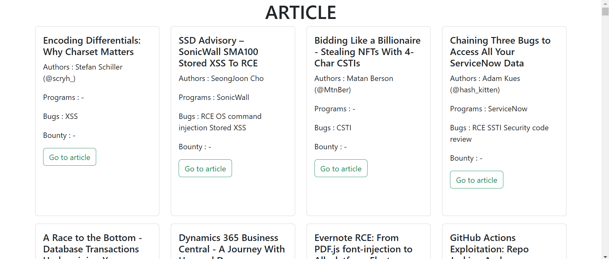

<h1 align="center">
   <a href="https://github.com/RegaAnton/reconmate.git" target="_blank" align="center">
      Reconmate Website
   </a>
</h1>

<p align="center">Menggunakan Bootstrap 5 sebagai Frontend Dan Laravel 11 sebagai Backend</p>



## Introduction 🚀

Website TimeBreak yang masih dalam tahap pengembangan

## Installation ⚒️

Installing and running Sneat is super easy, please Follow below steps and you will be ready to rock 🤘

-   Open the terminal in your root directory.

-   Clone Project

```bash
git clone https://github.com/RegaAnton/reconmate.git
```

-   Move to project

```bash
cd RECONMATE
```

-   Use the following command to install the composer

```bash
composer install
```

-   Copy .env.example ke .env

```bash
cp .env.example .env
```

-   Run the following command to generate the key

```bash
php artisan key:generate
```

-   Start Project

```bash
php artisan serv
```
